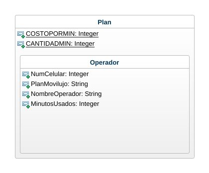

    QUIZ

1. Realice el analisis, diseño y construcción de la siguiente situación:

Crear un programa para gestionar un plan de telefonia movil. El plan tiene un numero de celular, un operador, una cantidad de minutos y un costo por minuto. Calcular el total a pagar teniendo en cuenta que si el operador el "movilujo" tiene un 50% de descuento. Usar minimo dos metodos constructores.

Diagrama de clases
